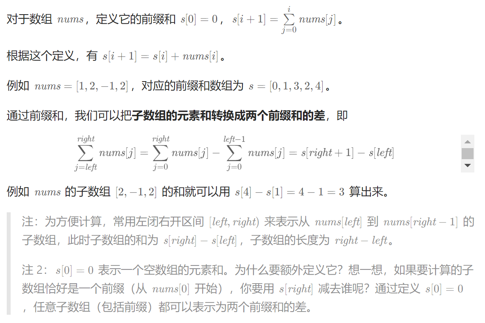

## 前缀和
来源：灵茶山艾府

## 前缀异或、
arr = {1,2,3,4,7}  
pre = make([]int, len(arr)+1)

pre[0]：0 = 0  
pre[1]：0 ^ 1 = 1  
pre[2]：1 ^ 2 = 3  
pre[3]：1 ^ 2 ^ 3 = 0  
pre[4]：1 ^ 2 ^ 3 ^ 4 = 4  
pre[5]：1 ^ 2 ^ 3 ^ 4 ^ 7 = 3  

To calculate the result of 3 ^ 4 ^ 7  
We know that 3 ^ 4 ^ 7 = (1 ^ 2) ^ (1 ^ 2 ^ 3 ^ 4 ^ 7) = pre[2] ^ pre[5]

Therefore: arr[m] ^ arr[m+1] ^ ... ^ arr[n] = pre[m] ^ pre[n-1]

